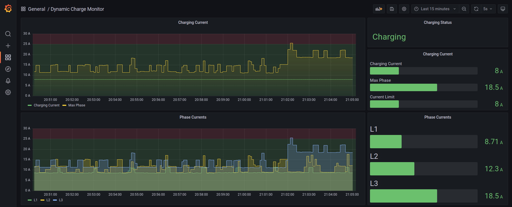
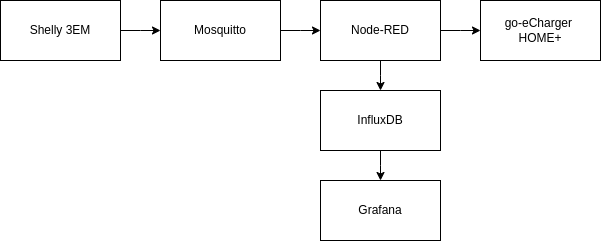

## About The Project


I have an electric car which can be charged with three phase AC charger. Main fuse size of my home is 25 A. If I charge car with 16 A from all phases, only 9 A is left for other devices. This is not much and hence the result is that occasionally 25 A main fuses will burn. To overcome this problem I wanted have a capability to dynamically adjust the power of my car charger according the total load of the house.

Features:

* All communication between the devices is wireless using existing WiFi network  
* Adjust go-eCharger HOME+ charging amps (6-16 A) with 5 s interval
* Use maximum value of phases to determine the instantaneous load
* Temporarily stop charging the car if main fuse load is over 25 A for 5 minutes in a row
* If charging is stopped manually from go-eCharger app, do not automatically continue charging
* Monitor key parameters in real-time in Grafana instance
* Possibility to limit maximum charging current (6-16 A)

### Built With
Built with the popular open source tools each running in own Docker container.



#### [Shelly 3EM](https://shelly.cloud)
3-phase energy meter with capability to publish data to external MQTT server.

#### [Mosquitto](https://mosquitto.org)
Popular open source MQTT message broker.

#### [Node-RED](https://nodered.org)
Programming tool for wiring together hardware devices, APIs and online services in new and interesting ways.

#### [go-eCharger HOME+](https://go-e.co)
Stationary and mobile charging station for electric vehicles. Can be controlled via HTTP and MQTT protocols.

#### [InfluxDB](https://www.influxdata.com)
Time-series database.

#### [Grafana](https://grafana.com)
Popular open source data visualization tool.

## Getting Started

### Prerequisites

#### [Docker](https://docker.com)
Docker platfrom is required to be installed and configured to get things up and running.

#### [Docker Compose](https://docs.docker.com/compose/)
Docker Compose is used to manage Docker containers

#### [GNU Make](https://www.gnu.org/software/make/)
Make tool is used to build necessary Docker images locally and clean all the persistent data.

#### [Git](https://git-scm.com)
Open source distributed version control system.

#### [Shelly 3EM API](https://shelly-api-docs.shelly.cloud/gen1/#shelly-family-overview)
Shelly 3EM needs to be installed by electrician to your house. After that it needs to be configured to send MQTT data to the host where this application is running inside your local network. 

### Installation

1. Clone the repo
    ```sh
    git clone https://github.com/aapiskukko/dynloadmgr.git
    ```
2. Go to the project folder
    ```sh
    cd dynloadmgr
    ```
3. Build some Docker images locally using Make
    ```sh
    make
    ```
4. Create copy of env file template
    ```sh
    cp example.env .env
    ```
5. Set go-eCharger HOME+ host name or IP address to .env file
    ```sh
    GO_E_CHARGER_HOST=192.168.86.94
    ```

## Usage

Go to the project folder before typing the commands below.

* Start up the software stack
    ```sh
    docker-compose up -d
    ```
* Close the software stack
    ```sh
    docker-compose down
    ```
    
### Visualization

Using a device that is connected to your WiFi go to the following address using a web browser:
```
http://[host]:3000
```
Host is the computer host name or IP address where this software stack is running.

### Configation

#### Change Maximum Charging Current 
1. Using a device that is connected to your WiFi go to the following address using a web browser:
    ```
    http://[host]:1880
    ```
2. In Node-RED UI, double click node `Charge Current`
3. Select desired current level in drop-down menu and press `Done`
4. Click `Deploy` in top right corner of Node-RED UI
